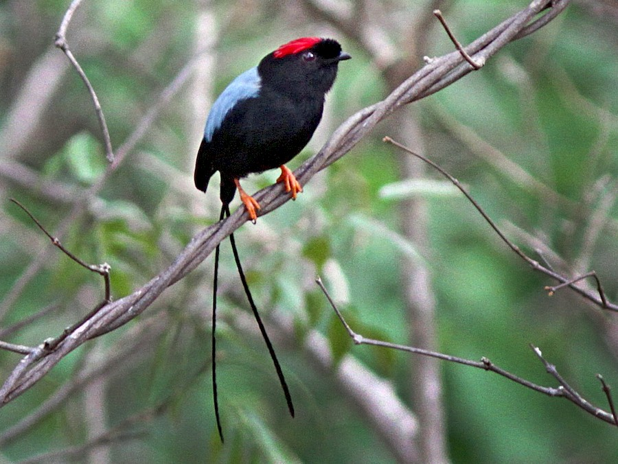

##*Chiroxiphia linearis*

###**Caracterización de la familia**
Las aves de la familia Pripridae son aves de la región nerotropicalque habitan en ambientes forestales. Suelen conocerse como saltarines y son una familai muy diversa taxonómicamente con cerca de 50 especies. 
Son aves frugívoras de bosques secundarios y son especialmente conocidos por sus conductas reproductivas tipo _"lek"_.
En este sistema, los machos son territoriales y exciben elaboradas danzas nupciales acompañadas de diversas vocalizaciones.

{width=400px}

###**Descripción científica**

Mide 11.5 cm. y pesa 19 grs. Las timoneras centrales alargadas le agregan de 10 a 15 cm. al largo total de los machos adultos, y de 2 a 3 cm. al de las hembras. Poseen frente abrupta y patas anaranjadas distintivas; es el único saltarín en la mayor parte de su distribución.
El macho es eminentemente negro, pero la coronilla, incluso la cresta bífida en la parte de atrás de la coronilla, es de color carmesí resplandeciente. La espalda es azul celeste, y muestra las timoneras centrales largas y muy angostas.
La hembra es verde oliva por encima y en el pecho, y exhibe la garganta más clara con un tinte grisáceo. Por debajo, la región posterior es oliva pálido, y se torna blancuzco en la parte baja del abdomen y la región infracaudal. En raras ocasiones presenta algo de rojo en la coronilla.
Los ejemplares inmaduros requieren de 3 a 4 años para adquirir el plumaje definitivo de adulto; al año tienen la coronilla roja, la cara fusca y las timoneras centrales más o menos alargadas. A los 2 años tienen el resto de la cabeza negruzca, algo de azul en la espalda y negro por debajo.
Los especímenes juveniles son similares a la hembra adulta, pero con el abdomen algo más claro.